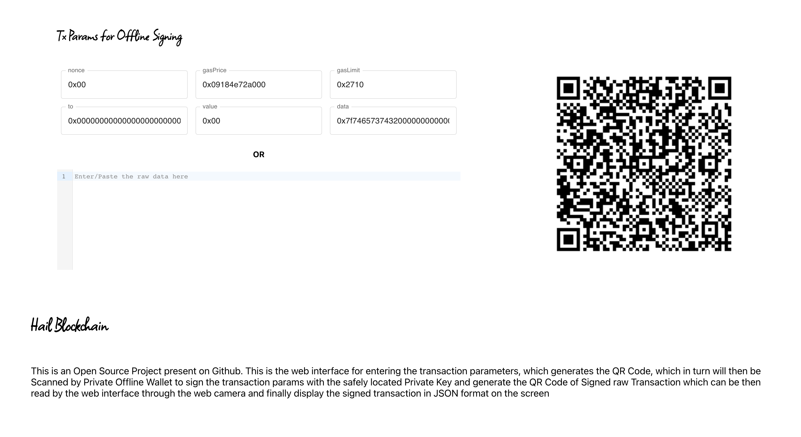

# transaction-offline-signing
A private offline wallet for signing incoming transaction from web

### Preview

This is the web interface for entering the transaction parameters, which generates the QR Code, which in turn will then be Scanned by Private Offline Wallet to sign the transaction params with the safely located Private Key and generate the QR Code of Signed raw Transaction which can be then read by the web interface through the web camera and finally display the signed transaction in JSON format on the screen